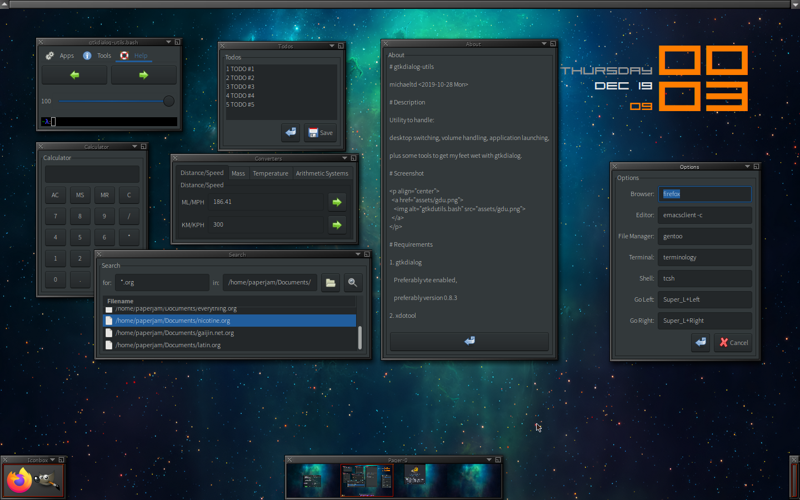

# gtkdutils

michaeltd <2019-10-28 Mon>

# Description

gtkdialog Utils

Utility to handle desktop switching, volume haldling, application launching,
plus some nifty tools just so I can fiddle with gtkdialog.

# Screenshot

# Requirements

1. gtkdialog (vte enabled)

2. xdotool

3. [sndvol](https://github.com/michaeltd/dots/blob/master/dot.files/bin/sndvol)
   in ~/bin/sndvol

4. [string.sh](https://github.com/michaeltd/dots/blob/master/dot.files/.bashrc.d/.stl/string.sh)
   in ~/.bashrc.d/.stl/string.sh
