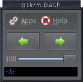

# gtkrm

michaeltd <2019-10-28 Mon>

# Description

gtkdialog Root Menu

Utility to handle desktop switching,
volume haldling, application launching.

# Screenshot

# Requirements

1. gtkdialog

2. xdotool

3. [sndvol](https://github.com/michaeltd/dots/blob/master/dot.files/bin/sndvol)
