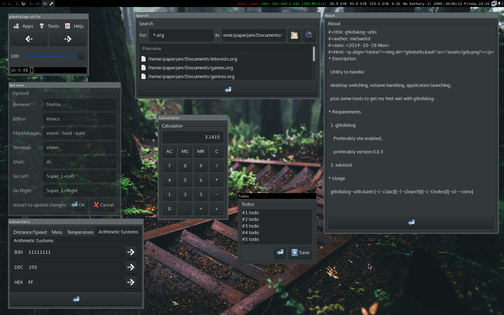

# gtkdialog-utils

michaeltd <2019-10-28 Mon>

# Description

Utility to handle:

desktop switching, volume handling, application launching,

plus some tools to get my feet wet with gtkdialog.

# Screenshot

# Requirements

1. gtkdialog

    Preferably vte enabled,

    preferably version 0.8.3

2. xdotool
